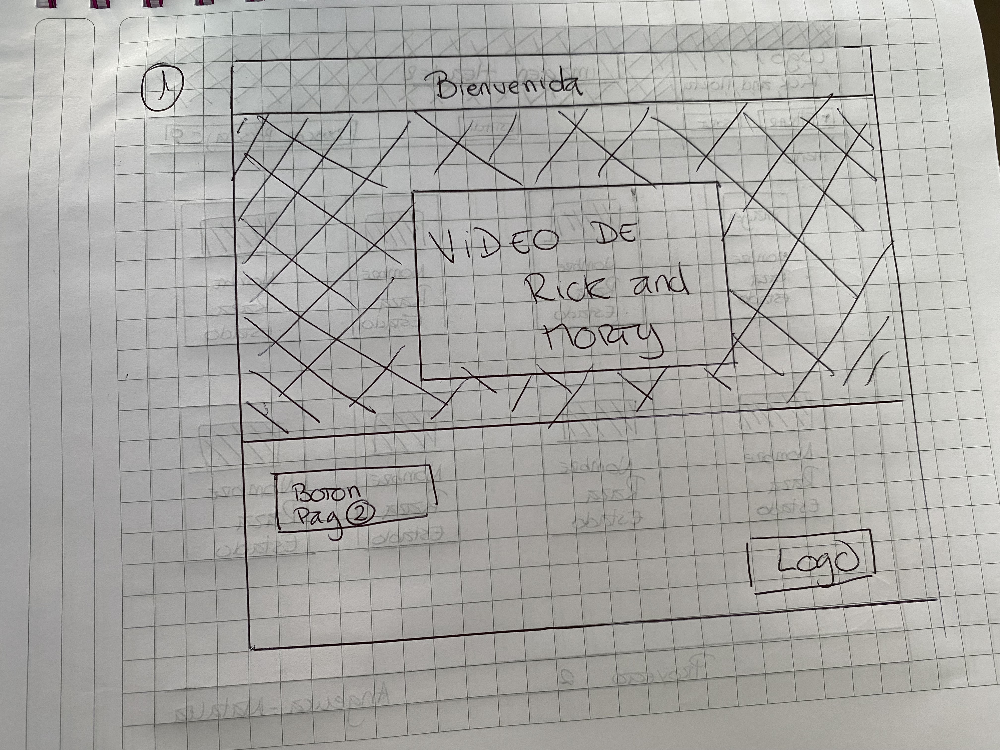
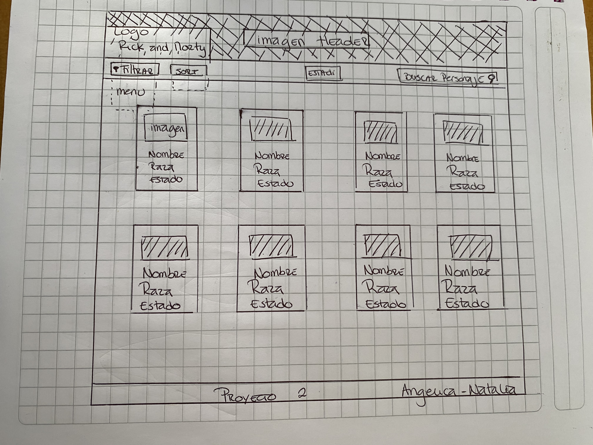
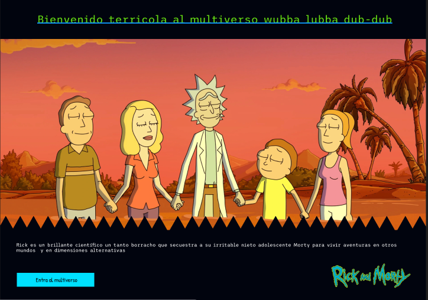
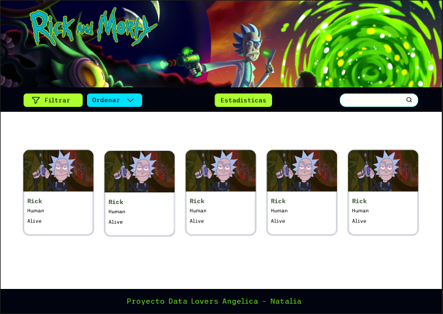
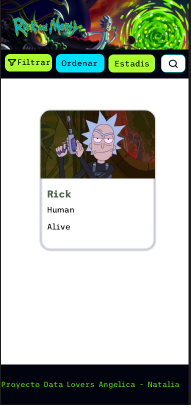

# Data Lovers Rick an Morty

## Preambulo

Realizamos una página Fandom de Rick and Morty, donde se puede ver una breve introducción sobre el programa y luego al entrar en la página se podran observar unas tarjetas con todos los personajes y algunos datos básicos de los mismos (Nombre, Raza y Estado), además se pueden filtrar por género,estado y ordenar de manera alfabetica.
Si es que quieres buscar un personaje por el nombre tambien lo puedes hacer, y si no recuerdas el nombre completo, se iran filtrado de acuerdo a las letras que se vayan escribiendo.
Realizamos un diseño responsive, para que los usuarios puedan ver desde cualquier  dispositivo movil.

## Historias de usuario

Para este proyecto tomamos dos historias de usuario, donde uno de ellos no conocia la serie y el otro sí.
El usuario que no estaba familiarizado, queria tener una breve introducción y acercamiento a la tematica de la serie.
Ambos querian ver fotos de los personajes al ingresar a la página, junto con datos basicos para tener una mayor referencia sobre los mismos.
Poder filtrarlos, por género y por estado.
Poder buscar a los personajes por el nombre.

### Prototipo de baja fidelidad

Realizamos prototipo de baja fidelidad para la página de Bienvenida y la página principal.

### Prototipo de alta fidelidad

El diseño de alta fidelidad lo diseñamos en Figma, donde teniamos tres diseños iniciales y realizamos una breve encuesta con los usuarios sobre cual preferian.
Finalemnte se eligió este diseño para realizar la página.

### Prototipo de alta fidelidad movil

### Figma

Los prototipos finales se pueden ver en Figma

[Pag Figma](https://www.figma.com/file/t7fCqVHGhpWcATcbYP4S40/Laboratoria_DataLovers?node-id=0%3A1)
